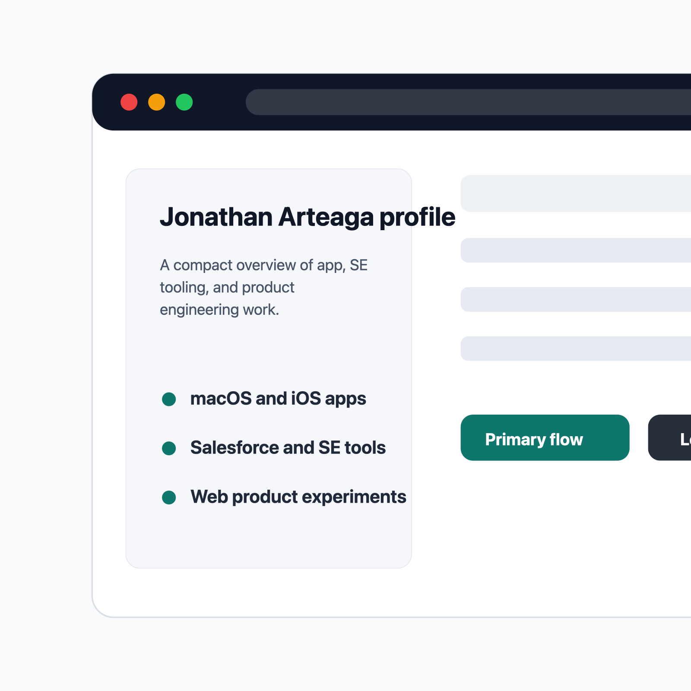

#

<h1 align="center">Jonathan Arteaga</h1>

#### A GitHub profile README for Apple apps, Salesforce tools, and web product work.

  

[Key Features](#key-features) &bull; [How To Use](#how-to-use) &bull; [Download](#download) &bull; [Credits](#credits) &bull; [Related](#related) &bull; [Support](#support) &bull; [You may also like](#you-may-also-like) &bull; [License](#license)



## Key Features

- Project index - Highlights active macOS apps, Salesforce tools, web apps, and product experiments.
- Builder profile - Summarizes practical product engineering work across Swift, TypeScript, and automation.
- Consistent links - Keeps the public profile aligned with the related repos in this workspace.

## How To Use

To update the GitHub profile README:

```bash
# Edit README.md
git add README.md docs/assets/screenshot.png
git commit -m "Update profile README"
git push origin main
```

## Download

This repository powers the GitHub profile README and does not ship a downloadable app.

## Credits

- Maintained by Jonathan Arteaga.

## Related

- [CaptureCue](https://github.com/jonathan-arteaga/capture-cue) - macOS capture studio.
- [MarkView](https://github.com/jonathan-arteaga/mark-view) - Markdown Quick Look extension.
- [SE VibeKit](https://github.com/jonathan-arteaga/se-vibe-kit) - SE workflow asset library.

## Support

Use the related project repositories for product-specific questions or fixes.

## You may also like

- [CaptureCue](https://github.com/jonathan-arteaga/capture-cue)
- [MarkView](https://github.com/jonathan-arteaga/mark-view)
- [Navigator](https://github.com/jonathan-arteaga/se-navigator)

## License

No license file is currently included.

---

> [jonathanarteaga.com](https://jonathanarteaga.com) &nbsp;&middot;&nbsp; GitHub [@jonathan-arteaga](https://github.com/jonathan-arteaga)
